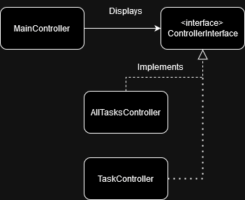

# DT042G project group 4 #

# Group members 
josef Alirani (joal2203)
Kevin Rosenbergs (kero2200)

# Environment and tools
The tools used to complete this lab were:

+ Git
+ Trello
+ JetBrains Intellij IDE
+ BitBucket

The lab was developed on:

+ Windows 11

# Introduction
For this project, it was decided that a to-do-list application was to be made using Java and the Swing API. In this app,
a user can add tasks that are should be completed at a specified date, which is then displayed in an ordered list.
To find a certain task, a searchbar is used to browse the database, this task can then be clicked to access a more 
detailed description for it. A user may also choose to delete a task, this is done by accessing the detailed view of a 
task and then clicking on a delete-button.

# Purpose
The purpose of this project is to utilize *test-driven development* (TDD) and a 
[kanban board](https://en.wikipedia.org/wiki/Kanban_board) in order to create an application in a group.

The concrete objectives of this project are:

+ The unittests need to convey incremental steps of the development, and cover a wide spectrum of the
solution. Tests should be made to cover both positives and negatives when it comes to behavior of the program.
+ Introspection/reflection should be used to validate aspects of the application.
+ The work needs to conform to Feature Branch Workflow, where contributions are only merged with master after an approved
peer review.
+ The project needs to adhere to the model-view-controller design pattern. The database (model) should have no concrete
connection to a view-class, all data must be passed through a controller.
+ The graphical user interface (GUI) must be made using the Java Swing API.

+ A user should be able to search for a task using a searchbar, by entering the task's title and/or it's category.
+ A user should be able to add a new task to the database.
+ Users should be able to delete existing tasks from the database.
+ The database, created with SQLite, should contain two tables, tasks and categories.
+ No global variables should be used.

# Procedures
This project was developed in the order: **controller-classes -> view-classes -> model-classes**. The reason for this order,
is that the model-classes consist of entities that communicate with the database that was being developed in parallel to the
application. The controller classes were implemented first, as they are responsible for acting as a middleman between
view-and model-classes. View-classes were then developed in order to start debugging/testing the program's GUI, before 
adding model-classes.

## controllers


controller-classes consist of a main-controller, a controller-interface and concrete implementations of that interface.
**MainController** is responsible for assigning which implementation of **ControllerInterface** to run and initiating the
program's JFrame window, this is done by having the class implement the **ActionListener** class so that it can listen for events
from a controller currently running using callbacks. This method allows the program to switch between different controllers
while using the same window-instance, and simplifies future implementations of new controller-classes because of this 
modular approach.

The ControllerInterface class was created so that **MainController** knows that a deriving controller-class implements 
a certain method, so that it does not have to create separate methods for handling each class:

``` Java
// MainController
    private void runController(ControllerInterface controller) {
        controller.doWork(window);
    }
```

The deriving class **AllTasksController** is used to display all tasks, while also providing a searchbar and a form, used 
to create a new task. This is done by adding the custom JComponent-classes **SearchBar, TasksPanel, SwitchButton, ImportButton
and TaskForm** to the window.
This class also implements **ActionListener** to handle events from these view-classes, these being: clicking the "search"-
button in the searchbar, submitting a new task, switch to the 'categories' display, and attempting to view a detailed
description of a specific task.
To verify that user input is valid when submitting a new task, the name and date is check individually. As the program
uses String commands for action events, new tasks cannot have the same name as these commands. To validate that the submitted
due-date is a valid date, it is checked in *isCorrectFormat()*, This function uses the built-in java class SimpleDateFormat
to compare the date with the date format "yyyy-MM-dd". 
The **ImportButton** triggers an event to the controller, which allows the user to select a JSON-file that contains information
about a task, the task is then added to the database by reading the fields within the file.

**TaskController** is used to display a detailed description of a task after clicking on it in AllTasksController, which
is done by adding the custom JComponents **ExportButton** and **TaskDisplay** to the window. Similar to AllTasksController,
it also implements **ActionListener** to process events from the TaskDisplay component. 
The **ExportButton** triggers an event to the controller when pressed, and that the currently displayed task is to be
exported as a JSON-file containing all details of the task. To avoid that two files have the same name, the controller 
first checks the folder, if the filename is already in use, a recursive method call is made and adding a suffix to the
filename.

``` Java
// TaskController --------------------------------------------------
private void exportTask(String name) {
        if(new File("tasks/"+name+".json").isFile()) {
            exportTask(name+"-1");
        }
        else {
            ...
        }
}
```

Both **AllTasksController** and **TaskController** takes an ActionListener as parameter for their constructor method, this
is the **MainController** that is passing itself when initiating a new controller to run. This lets the deriving classes
communicate to their ActionListener via the method "actionPerformed()":

``` Java
// TaskController --------------------------------------------------
    @Override
    public void actionPerformed(ActionEvent e) {
    
        // tells MainController that the user wishes to return to
        // the list of all tasks, shown via AllTasksController
        if(e.getActionCommand().equals("return")) {
            listener.actionPerformed(new ActionEvent(this,
                    ActionEvent.ACTION_PERFORMED, "back"));
        }
        ...
    }

// MainController --------------------------------------------------
    @Override
    public void actionPerformed(ActionEvent e) {
    
        // recieves an event containing the message "back" from
        // TaskController and switches to the AllTasksController
        if(e.getActionCommand().equals("back")) {
            runController(new AllTasksController(this));
        }
        ...
    }
```

The **CategoriesController** class is to be used for displaying categories in a scrollable list, similarly to the way
**AllTasksController** shows tasks. To implement this, first the class was created by implementing the **ControllerInterface**
and adding the view-components: **SearchBar, SwitchButton, CategoriesForm** and **CategoriesPanel** to the window.
For this controller to listen to events triggered by these components, it also implements the **ActionListener** class,
the class instance can then be passed to the view components when initializing them. The events which this class needs to
handle are:

+ *Switch*: Event command triggered by clicking the SwitchButton, this should in turn send an event to the **MainController**,
signaling that it should switch to **AllTasksController**.
+ *Submit category*: Triggered when the **CategoryForm** is submitted, used to add a new category to the database.
+ *Search*: Triggered when using the **SearchBar** to browse for a specific category, used to update the list of 
categories to show only ones containing a specified string.
+ *Delete*: Event for deleting a category from the database, triggered when pressing the delete-button displayed next to
a category in the list. 


## views
The main window that the program uses is **AppWindow** which is a class that extends **JFrame**, aside from initializing
the window's properties, it also provides methods for adding JComponents to it, as well as removing them. For the view-classes
used by the AllTasksController, **TaskForm** and **SearchBar** were made by extending **JPanel**, but for **TasksPanel** 
to be scrollable, it had to extend **JScrollPane** instead. The content of TasksPanel is appended to a private JPanel 
variable within the class that is used as its viewport-view. Like AppWindow, the class provide methods for adding and 
removing their content. The tasks are displayed using **JButton**:s, which trigger an event when clicked, this event is
sent to AllTasksController to be processed:

``` Java
// TasksPanel -----------------------------------------------------
    public void addTasks(ArrayDeque<String> tasks, ActionListener listener) {

        clearTasksPanel();

        int i = 1;
        for(String task: tasks) {
            JButton label = new JButton(i+": "+ task);
            label.addActionListener(e -> listener.actionPerformed(new ActionEvent(this,
                    ActionEvent.ACTION_PERFORMED, task)));
            panel.add(label);
            i++;
        }
        this.setViewportView(panel);
        this.setVisible(true);
    }
```

Similarly to **TasksPanel**, **CategoriesPanel** had to be scrollable, therefore it also extends **JScrollPane**, and 
adds categories to a list via a JPanel class variable. However, as categories do not contain any additional information 
aside from a description, there is no need to implement a display for a specific category, unlike **TasksPanel**.
Therefore, the delete-button for each category is also shown in the list.

The classes that extend JButton, **ImportButton, ExportButton** and **SwitchButton** functions the same way, by taking a
ActionListener as parameter for their constructor method, the events that the buttons trigger are added with the listener
as receiver.

## Models

## Obstacles
An obstacle that occurred when implementing the AllTasksController, was how to create a scrollable JPanel. At first,
TasksPanel extended **JPanel** and had a **JScrollPane** as private class variable which was appended to the class-instance.
This caused the content of the panel to overflow, but not provide a scrollbar. After reading documentation of the JComponents,
the order of JPanel and JScrollPane was reversed, as JScrollPane is a container which provides a scrollbar when its content
does not fit its bounds.

# Discussion
The purpose of this assignment was to used TDD and a kanban board to create an application in a group environment, to do
this, it was decided that a to-do-list app was to be made. The main functionality of this program was to be able to store, 
remove and display tasks to a user via a graphical user interface. The solution is suitable because it fits the criteria
specified in [purpose](#purpose), and passes the unit tests that were created. The unit tests created intend to show that
the project's entities and methods behave as intended. Along with positive tests to check if return values and components
produce expected results, negative tests that expect failure were also used to make sure these runtime errors are handled
appropriately. Because all these tests passed, it indicates that the solution is appropriate.

## View classes
The implementation of view-classes in the project is appropriate as they conform to the MVC design pattern by not having
a direct connection to model-classes/the database, all data is passed from a controller. As all view-components are extending
classes from the Java Swing API, and does not use any global variables, they conform to the criteria stated in the project
purpose. For testing a majority of the view-classes, it was decided that the optimal method was to visually gauge the 
implementation of components when printed onto a window instead of unit tests. The reason for this is that writing unit
tests to check whether a component is given enough screen-space, or that a scrollbar is showing as well as working is a
complex task, in comparison to visually determining if a view-class is working as intended. 
The additional functionalities for view-classes was tested however, such as validating that the correct event command is
sent to their ActionListener. 
For the classes **CategoriesPanel** and **TasksPanel**, tests for adding tasks/categories to display in a list were added
to ensure that text is displayed as intended/contains the expected elements.

## Controller classes
Controller-classes in the project are appropriate for the solution, as they correctly handles what is shown in the view-classes,
and manages the model-classes by updating and retrieving data. The controller-classes all fit the project criteria by 
conforming to the MVC-pattern and does not include any global variables as stated in the purpose-section of this report.
The results of the unit tests made for the controller classes indicate that the solution is suitable, as the behaviour 
of the classes is verified because both negative and positive tests are used.

## Model classes

## Alternative solutions
An alternative method to switching between controllers, could be to have controller communicate without **MainController**
acting as a middleman:

``` Java
// AllTasksController

    @Override
    public void actionPerformed(ActionEvent e) {

        if(e.getActionCommand().equals("search")) {
            performSearch(searchBar.getQuery());
        }
        ...
        else {
            // instead of calling MainController to switch,
            // it is instead performed in class.
            
            // listener.actionPerformed(new ActionEvent(this,
            //        ActionEvent.ACTION_PERFORMED, e.getActionCommand()));
            
            TaskController task = new TaskController(...);
            task.doWork();
        }
        ...
    }
```

The advantage of this approach, is that it does not need a separate class to handle switching, thereby reducing overhead.
However, this alternative may have more duplicate code/class variables across controller-classes, as each class have to 
store an instance of the AppWindow. The value of having a controller for controllers increases as the amount of controller-classes
increases, but as this project only uses two controllers, both methods for switching are suitable for the solution. 

## Personal reflections
In this project, methods introduced from previous assignments of this course was used to create an application in a group.
From this, we've learned how a kanban board and feature branch workflow can be used to simplify/ensure collaboration 
when more people work on the same project.